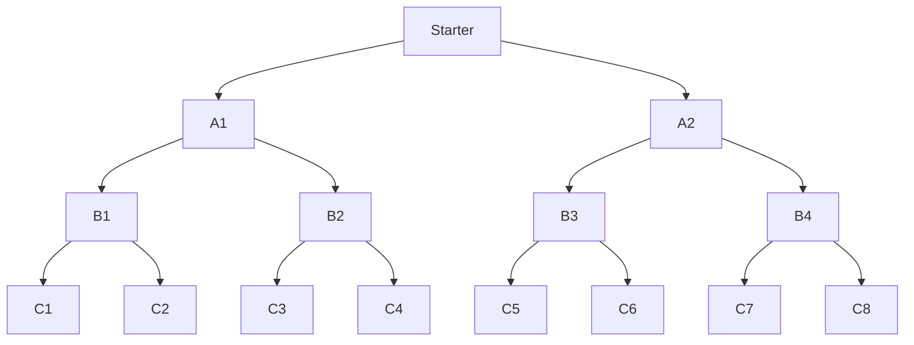
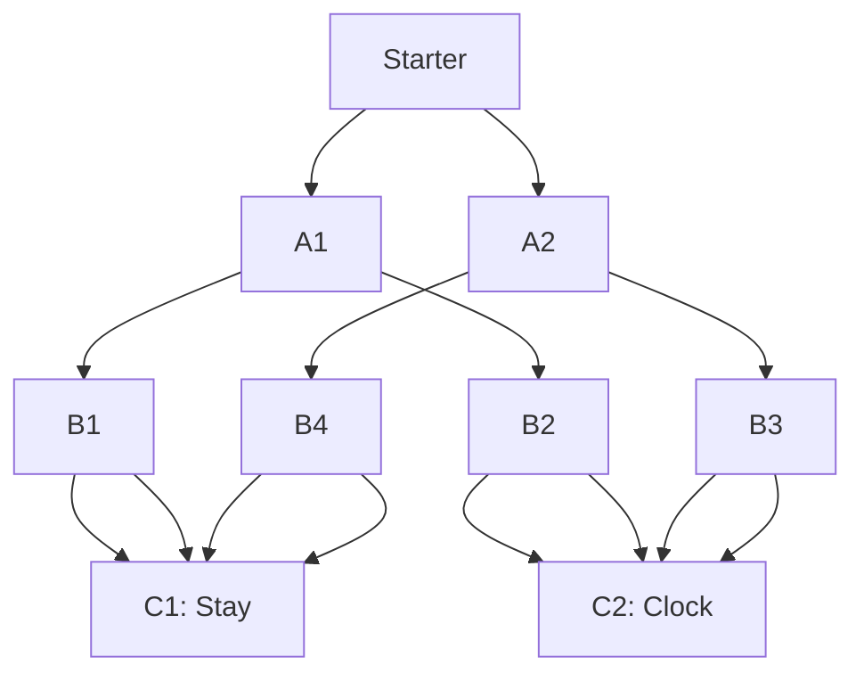

<!-- markdownlint-disable MD033 MD041 -->
<a href="/lite/lab/index.html?path=python/02-control-flow/projects/adventure-story-v1.ipynb" target="_blank">
  
</a>
<!-- markdownlint-enable MD033 MD041 -->


<!-- markdownlint-disable-next-line MD041 -->
[Go back to Home](/) - [Go to lesson page](/docs/python/control-flow/projects/adventure-story-v1) - [Go to Control Flow section](/docs/python/control-flow)

# Adventure Story v1

We're going to create an adventure story using what we learned. This will help you remember if statements. I'm going to walk you through how to create this one step at a time. I'll talk through the thinking process.

We're going to make the game part very simple to start with. If you want, you can keep going and make something really interesting! You can make as many choices as you want. Just remember, the more choices, the more complicated, and the more difficult it is to keep track. We have easier ways of creating and maintaining things as they get more complicated.

<a href="/lite/lab/index.html?path=python/02-control-flow/projects/adventure-story-v1.ipynb">If you open this notebook in the Lab</a>, you can click on the diagram and see ` ```mermaid `. This is a way of diagramming things in code. It's very handy, and we'll cover it in another lesson.


```python
print("""
     Welcome to the Adventure!
Select what theme you would like for your game.

""")

# remember this from our print lesson?
print("🎮 Game Menu")
print("------------")
print("1. 🚀 Sci-Fi")
print("2. 🧙 Fantasy")
print("3. 🦖 Dinosaur")
print("4. 🕵️ Mystery")
print("5. ❌ Quit")
```

<!-- markdownlint-disable MD033 MD009 -->
<div class="output-cell">

      
         Welcome to the Adventure!  
    Select what theme you would like for your game.  
      
      
    🎮 Game Menu  
    ------------  
    1. 🚀 Sci-Fi  
    2. 🧙 Fantasy  
    3. 🦖 Dinosaur  
    4. 🕵️ Mystery  
    5. ❌ Quit  


</div><br/>
<!-- markdownlint-enable MD033 MD009 -->


```python
menu_selection = 1
name = "Katie"
```

We're going to create a dictionary for each theme that contains some important information that we can reuse.

The next four cells define a dictionary for each story and print a key-value pair for each.


```python
sci_fi_dict = {
    "story_type": "sci-fi",
    "vehicle_name": "Starbender",
    "vehicle_type": "intergalactic cruise ship",
    "problem": "Things have been disappearing from people's rooms.",
    "starter": (
        "fixing a malfunctioning gravity controller "
        "in the honky tonk dance hall. "
        "It's scheduled to open in 20 minutes. "
        "You notice a few unusual power spikes."
    ),
}
sci_fi_dict.get("starter")
```

<!-- markdownlint-disable MD033 MD009 -->
<div class="output-cell">


    "fixing a malfunctioning gravity controller in the honky tonk dance hall. It's scheduled to open in 20 minutes. You notice a few unusual power spikes."


</div><br/>
<!-- markdownlint-enable MD033 MD009 -->


```python
fantasy_dict = {
    "story_type": "fantasy",
    "vehicle_name": "Root Grinder",
    "vehicle_type": "scout horse",
    "problem": (
        "The princess of the land"
        " had a vision of a new enemy."
    ),
    "starter": "organizing notes for your mentor, a sorceress."
}
fantasy_dict.get("vehicle_name")
```

<!-- markdownlint-disable MD033 MD009 -->
<div class="output-cell">


    'Root Grinder'


</div><br/>
<!-- markdownlint-enable MD033 MD009 -->


```python
dinosaur_dict = {
    "story_type": "dinosaur",
    "vehicle_name": "Guts",
    "vehicle_type": "armored dino",
    "problem": "The bugs have been growing bigger.",
    "starter": (
        "on the way to check on the pterosaur "
        "unit. They haven't reported back after their "
        "latest sortie."
        )
}
dinosaur_dict.get("vehicle_type")
```

<!-- markdownlint-disable MD033 MD009 -->
<div class="output-cell">


    'armored dino'


</div><br/>
<!-- markdownlint-enable MD033 MD009 -->


```python
mystery_dict = {
    "story_type": "mystery",
    "vehicle_name": "City Stops Regional",
    "vehicle_type": "trolley",
    "problem": "A woman is seemingly killed by her AI caregiver.",
    # "mystery problem" is from one of my favorite short stories:
    #     "The Final Performance of the Amazing Ralphie"
    "starter": (
        "slouching in a trolley seat, on the way to work "
        "at an investigative unit specializing in crime "
        "committed by computers."
        )
}
mystery_dict.get("story_type")
```

<!-- markdownlint-disable MD033 MD009 -->
<div class="output-cell">


    'mystery'


</div><br/>
<!-- markdownlint-enable MD033 MD009 -->

Next, we can apply our chosen theme to a story. We will be changing it, so let's make sure we set the chosen_theme to something. We selected "mystery," so we want to set `chosen_theme` to `mystery_dict`.

To decide what to put in each dictionary, I had the initial idea of each story having some kind of interesting vehicle involved so our main character can travel. Because in my favorite science fiction series, they're on a ship in space.

So I wrote the `story_intro` and filled in each dictionary item a little at a time, going back and forth between the two.


```python
chosen_theme = sci_fi_dict

story_intro = f"""
Welcome to the {chosen_theme.get("story_type")} world, {name}.

You are on an {chosen_theme.get("vehicle_type")}, called
{chosen_theme.get("vehicle_name")}.

But something has happened! {chosen_theme.get("problem")}

You're {chosen_theme.get("starter")}

What do you do next?
"""

print(story_intro)
```

<!-- markdownlint-disable MD033 MD009 -->
<div class="output-cell">

      
    Welcome to the sci-fi world, Katie.  
      
    You are on an intergalactic cruise ship, called  
    Starbender.  
      
    But something has happened! Things have been disappearing from people's rooms.  
      
    You're fixing a malfunctioning gravity controller in the honky tonk dance hall. It's scheduled to open in 20 minutes. You notice a few unusual power spikes.  
      
    What do you do next?  
      


</div><br/>
<!-- markdownlint-enable MD033 MD009 -->

Oooo! I wonder what happens next.

We're going to put some things together in string variables to help us organize all this.

I started out by creating the prints and if-then statements without variables. I started to get an idea of the direction I wanted the story to go. I realized a few paths can come back together, so I can reuse paths in multiple places. I wanted to make sure I had paths that converged like this, but I wasn't totally sure how I would do it or what the story would be.

This type of method works fine for smaller projects, but drawing it out or writing it out on paper can be very helpful for big and small projects. Brainstorming can help a lot.

Below, we define our story


```python
A1 = "Call your supervisor to let them know they can open the dance hall."
B1 = "Stay and monitor the system quietly during the first dance."
B2 = "Head back to write a report and clock out."
```


```python
A2 = "Run a secondary diagnostic to troubleshoot the electrical."
B3 = "Mention you started it in your report for your shift. Clock out,"\
    + " and head back to your bunk."
B4 = "Stay and wait for the diagnostic to finish."
```

If every choice can diverge into a different  if-then is going to lead us to this type of flow, and you'll have a lot of story pieces to manage. We're going to do things a little differently.




```python
print(f"""
Select one of the following by entering 1 or 2.
1. {A1}
2. {A2}
""")

choice1 = 2
```

<!-- markdownlint-disable MD033 MD009 -->
<div class="output-cell">

      
    Select one of the following by entering 1 or 2.  
    1. Call your supervisor to let them know they can open the dance hall.  
    2. Run a secondary diagnostic to troubleshoot the electrical.  
      


</div><br/>
<!-- markdownlint-enable MD033 MD009 -->


```python
choice = choice1
```


```python
if (choice == 1):
    print(f"""
The floor stabilizers power up. You feel the floor vibrate and
pull you down. The disco ball hologram flickers to life.
everything looks ok.

Choose your next move.

1. {B1}
2. {B2}
""")
elif (choice == 2):
    print(f"""The diagnostic will take a while to run. It already
looks a little off, but you'll wait to make any judgements until
it's done.

What's your next move?
1. {B3}
2. {B4}
""")
```

<!-- markdownlint-disable MD033 MD009 -->
<div class="output-cell">

    The diagnostic will take a while to run. It already  
    looks a little off, but you'll wait to make any judgements until  
    it's done.  
      
    What's your next move?  
    1. Mention you started it in your report for your shift. Clock out, and head back to your bunk.  
    2. Stay and wait for the diagnostic to finish.  
      


</div><br/>
<!-- markdownlint-enable MD033 MD009 -->


```python
choice2 = 1
```

Notice we have a few choices that can lead us to the same next path.

You can have your story converge to fixed important events if you want, or maybe you like for each path to have a very different outcome.

Here, we have the same thing happen on these different paths. Something interesting we can do with the story if it converges is we can have the character know different things at different points. Maybe the character's experience is different for the different paths.

Here's an updated diagram.



One of the reasons we are putting the text in variables is because this helps us to reuse code.

When we save things in a variable, we don't have to repeat code. In this case, we would be repeating the story text in our print. If we wanted to change something about the story, we would have to change it in each place. With variables, we change it in one place.


```python
# stay in the dance hall a little longer (B1, B4)
C1 = (
    "You had started the program and let it run for a minute. Since you know "
    "it's started running fine, you decide to get up and stretch your legs. "
    "People have already started to stream in, get drinks, chat. The AI DJ "
    "boots up and starts to play quiet music. It's even programmed to make "
    "small talk with people in the crowd. Everyone signs terms of service to "
    "allow their data to be used for entertainment and promotional purposes, "
    "including for the on-board AI to access. You stretch. You were under "
    "the panel for a long time. You step out on the edges of the dance hall."
    " Part of your job is staying out of sight a bit, but it's dark, so no "
    "one will see you. As you look around, you see a couple of drink glasses "
    "at an empty table. But when you look back, you think maybe one of "
    "them looks less full than it was a second ago. Could be anything. "
    "Maybe you're just tired."
)

# you clock out (B2, B3)
C2 = (
    "On the way walking back to the office, you happen to look up "
    "and see one of the old service drones lit up. But those "
    "were decommissioned months ago. Maybe it's just a maintenance "
    "cycle. They want to repurpose them, so maybe they need to "
    "keep them running smoothly."
)
```


```python
if (choice == 1):
    print(C2)
elif (choice == 2):
    print(C1)
else:
    print("Invalid selection.")
```

<!-- markdownlint-disable MD033 MD009 -->
<div class="output-cell">

    You had started the program and let it run for a minute. Since you know it's started running fine, you decide to get up and stretch your legs. People have already started to stream in, get drinks, chat. The AI DJ boots up and starts to play quiet music. It's even programmed to make small talk with people in the crowd. Everyone signs terms of service to allow their data to be used for entertainment and promotional purposes, including for the on-board AI to access. You stretch. You were under the panel for a long time. You step out on the edges of the dance hall. Part of your job is staying out of sight a bit, but it's dark, so no one will see you. As you look around, you see a couple of drink glasses at an empty table. But when you look back, you think maybe one of them looks less full than it was a second ago. Could be anything. Maybe you're just tired.  


</div><br/>
<!-- markdownlint-enable MD033 MD009 -->

:::tip
I recommend you <a href="/lite/lab/index.html">open a blank notebook in the lab</a> for any of the activities. Ask yourself questions, like "What do I need next?" or "What happens first?" And try to remember what you learned. If you have to look up syntax, that's ok. You'll remember it with time and experience.
:::

## Conclusion

We used if statements to create a story.
